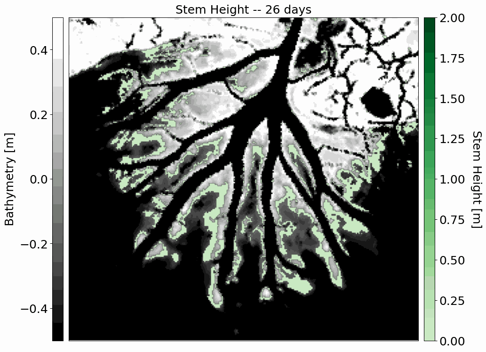

DYCOVE
======

**DYCOVE** (die-KOH-vee), short for DYnamic COastal VEgetation, is a Python package used for tightly coupling 
dynamic vegetation processes with 2-D hydrodynamic models in coastal environments.

DYCOVE takes as input a set of vegetation characteristics for any number of species of interest and computes colonization, growth, and mortality of those species based on hydrodynamic (and morphodynamic) conditions present in each grid cell in the numerical model. 
In turn, the evolving vegetation changes the flow resistance in the numerical model. 
The strength of DYCOVE lies in its ability to model the evolution of coastal vegetation species as well as provide hydro-morphodynamic models with a robust representation of roughness that can change over time.

Refer to the `documentation <https://Ecomomo-lab.github.io/dycove-model/index.html>`_ for installation instructions, quick-start examples, API reference, and more.

**Development of two vegetation species in the Wax Lake Delta**

Currently, DYCOVE supports coupling with `ANUGA <https://github.com/GeoscienceAustralia/anuga_core>`_ and `Delft3D Flexible Mesh <https://oss.deltares.nl/web/delft3dfm>`_.

The logic behind this model was developed as part of the following study, which coupled a MATLAB vegetation code with Delft3D 4:

    Brückner, M. Z. M., Schwarz, C., van Dijk, W. M., van Oorschot, M., Douma, H., & Kleinhans, M. G. (2019). Salt marsh establishment and eco-engineering effects in dynamic estuaries determined by species growth and mortality. Journal of Geophysical Research: Earth Surface, 124, 2962-2986. https://doi.org/10.1029/2019JF005092

If you use DYCOVE in your work, please cite the following JOSS paper in submission:

    Tull & Brückner (submitted). DYCOVE: A Python package for coupling dynamic vegetion processes with hydro-morphodynamic models. Journal of Open Source Software.