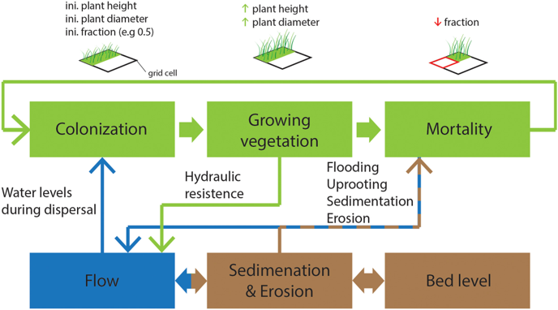

.. _background:

Background
==========

Motivation
----------

DYCOVE originated as a MATLAB code coupled with Delft3D 4 [1]_.
In that study by Brückner et al. (2019), the dynamic vegetation approach was shown to reproduce observed vegetation distributions in salt marshes.
With DYCOVE written in Python, we can couple to the widely-used and modernized hydro-morphodynamic model `Delft3D FM (DFM) <https://oss.deltares.nl/web/delft3dfm>`_ [2]_, while also offering a fully open-source avenue with the `ANUGA hydrodynamic model <https://github.com/GeoscienceAustralia/anuga_core>`_ [3]_.
Furthermore, DYCOVE is written in such a way that will allow for straightforward integration of other hydro-morphodynamic models and modules in the future.

Model Overview
--------------

DYCOVE allows users to incorporate vegetation in their numerical models in a dynamic way. 
A set of vegetation species input parameters must be provided in the form of a :ref:`.json file <input-json>` that describes species attributes such as initial and maximum stem height and diameter, number of life stages, colonization window, and more.
Simulations are run by calling a model engine class (depending on which numerical model is being used) that implements the time stepping methods specific to that model.
At regular intervals, typically one tidal cycle, hydrodynamic and morphodynamic statistics from the preceding interval are used to compute changes in vegetation state (colonization and mortality).
Vegetation stem height, stem diameter, and root length growth are determined purely based on species characteristics defined in the input `.json` file.
These parameters, along with stem density (based on species life stage), are passed back to the numerical model via the :ref:`Baptist formulation <baptist-chezy>`, which calculates a Chezy roughness value.

   A representation of the major components of a DYCOVE model and their feedback mechanisms.

.. _eco-time-scale:

The Ecological Time Scale
-------------------------

DYCOVE simulations run on the idea that vegetation and morphological changes both occur on longer time scales than hydrodynamic changes.
Therefore, we "accelerate" vegetation processes in a manner similar to the Morphological Acceleration Factor (MORFAC) of DFM.
In fact, for DYCOVE-DFM simulations with morphology active, we set the Ecological Acceleration Factor (``ecofac``) equal to the ``morfac`` of the DFM model.

To reconcile the hydrodynamic and ecological time scales, we run simulations by defining the following parameters:

- ``ecofac``: Ecological Acceleration Factor, a multiplier representing the ratio of ecological time to hydrodynamic time.
- ``veg_interval``: Vegetation coupling interval, in hydrodynamic seconds, defining how often changes in vegetation are computed and passed back to the hydrodynamic model.
- ``n_ets``: Number of Ecological Time Steps, or vegetation coupling intervals, per ecological year.

Because DYCOVE is most useful for modeling vegetation in the intertidal zone, it is convenient to structure simulations around full tidal cycles.
We compute colonization and mortality by identifying wet/dry grid cells, and the fraction of time they are wet/dry during the previous ``veg_interval``. 
For mortality, we also need to know the maximum velocity at each grid cell.
Therefore, it makes the most sense to do these calculations after at least one full tidal cycle, and so we typically set ``veg_interval`` to be equal to one tidal cycle. 
For your typical semi-diurnal tide, one cycle is about 12 hours (43200 seconds), rounding down for simplicity.
We must decide, then, whether we want to prescribe the ``ecofac`` of our simulation or ``n_ets``, and then the other variable will follow:

.. math::

    \small \text{ecofac} \approx \frac{365 \times 86400}{\text{veg_interval} \times \text{n}_{\text{ets}}}

The default value of ``n_ets`` is 14, because that provides enough temporal resolution to describe seasonal growth patterns for many species.
``n_ets`` must be compatible with the growth and colonization ETS attributes defined in the vegetation input `.json` file.
Using the default values of ``veg_interval`` and ``n_ets`` yields an ``ecofac`` of 52.
While there is no default value for ``ecofac``, if it is not provided, it will be computed based on the other two variables using the above equation.
Alternatively, the user can provide ``ecofac`` directly, or by running a morphological simulation with a specified MORFAC, but they must ensure that the other two inputs (whether default or provided) are compatible based on the above equation.
It is recommended that users pre-compute these three values to make sure they make sense.
Users can specify a more round value of ``ecofac = 50``, for example, which would correspond to 350 days per year in the model.
It is fine, and in fact encouraged, to use a round value in this way, but keep in mind that DYCOVE includes a hardcoded limit of ``DAYS_PER_YEAR`` between 350 and 380 to keep results reasonable.

DYCOVE simulations can always be run using the default values provided in :meth:`~dycove.sim.base.HydroSimulationBase.run_simulation`.

.. _input-json:

Vegetation Input File
---------------------

The vegetation input `.json` file contains both physical and time-related attributes of the species (one file per species if modeling :ref:`multiple species <multi-species>`).
Vegetation attributes are passed to the :class:`~dycove.sim.vegetation_data.VegetationAttributes` class, which contains descriptions of each input.
These attributes are explained with more context in subsequent sections.
The input `.json` file must consist of a dictionary like the one below (taken from the :ref:`tide channel example <tide-channel-anuga>`).
The first set of attributes are "general" attributes, and the second set are "life stage" attributes.
This particular set of attributes, used in Brückner et al. (2019), is loosely based on `Salicorniaspp.` (pioneer species, first life stage) and `Spartina anglica` (second life stage).

.. code-block:: python

   {
     "age_max": 20,
     "nls": 2,
     "fraction_0": 0.4,
     "stemht_0": 0.1,
     "rootlength_0": 0.005,
     "stemdiam_0": 0.005,
     "start_growth_ets": 2,
     "end_growth_ets": 9,
     "winter_ets": 10,
     "start_col_ets": 2,
     "end_col_ets": 3,
   
     "life_stage_attr": [
       {
         "stemht_max": 0.6,
         "rootlength_max": 0.02,
         "stemdiam_max": 0.01,
         "years_max": 1,
         "stemdens": 300,
         "drag": 1.0,
         "desic_no_mort": 0,
         "desic_all_mort": 1.3,
         "flood_no_mort": 0.3,
         "flood_all_mort": 0.45,
         "uproot_no_mort": 0.25,
         "uproot_all_mort": 0.4,
         "stemht_winter_max": 0.3
       },
       {
         "stemht_max": 1.0,
         "rootlength_max": 0.1,
         "stemdiam_max": 0.01,
         "years_max": 19,
         "stemdens": 500,
         "drag": 1.1,
         "desic_no_mort": 0,
         "desic_all_mort": 1.3,
         "flood_no_mort": 0.3,
         "flood_all_mort": 0.45,
         "uproot_no_mort": 0.4,
         "uproot_all_mort": 0.55,
         "stemht_winter_max": 0.5
       }
     ]
   }

Vegetation Coupling Processes
-----------------------------

The coupling between vegetation and the numerical model is handled via :class:`~dycove.sim.coupler.VegetationCoupler`.
As mentioned in the previous section, vegetation is coupled to the numerical model after each ``ets``, or every ``veg_interval`` seconds.
During each coupling, the following steps take place before the hydrodynamics continue (each are explained in more detail in subsequent sections):

1. :ref:`**Life stage update** <life-stages>`
2. :ref:`**Growth** <growth>`
3. :ref:`**Colonization** <colonization>`
4. :ref:`**Mortality** <mortality>`
5. :ref:`**Compute vegetation** <compute-veg>`
6. :ref:`**Hydrodynamic feedback** <baptist-chezy>`

.. _life-stages:

Life Stages
-----------

Relevant `.json` input attributes:

- ``'age_max'``: Maximum age of the species in years. Must be equal to the sum of ``'years_max'`` across all life stages.
- ``'nls'``: Number of life stages for the species.
- ``'years_max'`` (life stage attr.): Maximum number of years spent in a life stage.

DYCOVE allows for multiple life stages in case of species that do not have consistent attributes across the species lifetime.
There will always be one set of general attributes per species, but there can theoretically be any number of sets of life stage attributes, as long as the number of life stage dictionaries is equal to ``'nls'`` in the general attributes.

During each ``ets``, or coupling, we check if the current ``ets`` is equal to ``n_ets`` (end of the year).
If so, we increment the age of all vegetation by one year.
If the end of the life stage is reached (i.e., age in current life stage is equal to ``'years_max'``), the vegetation transitions to the next life stage.
If the maximum age of the species is reached, the vegetation cohort dies and is removed from the model.

.. _colonization:

Colonization
------------

Relevant `.json` input attributes:

- ``'fraction_0'``: Maximum fractional area of a model grid cell that will be filled with vegetation upon colonization, as long as there is space available.
- ``'stemht_0'``: Initial stem height upon colonization.
- ``'rootlength_0'``: Initial root length upon colonization.
- ``'stemdiam_0'``: Initial stem diameter upon colonization.
- ``'start_col_ets'``: Ecological time step at which colonization can begin (inclusive).
- ``'end_col_ets'``: Ecological time step at which colonization ends for the year (non-inclusive).

Colonization may occur during one or more ``ets`` throughout the year, but typically, it occurs early in the ecological year.
The colonization window is defined by the ``'start_col_ets'`` and ``'end_col_ets'`` input attributes.
For example, if ``'start_col_ets' = 2`` and ``'end_col_ets' = 3``, colonization will only occur during the second ``ets`` of each year.
Note that if ``'start_col_ets' = 1`` and ``'end_col_ets' = 2``, the species will not colonize during the first year because one tidal cycle must run first.

Currently, colonization will take place in grid cells that were BOTH dry AND wet for any amount of time during the previous ``ets``.
During a colonization event, all eligible grid cells that are not fully vegetated (i.e., total vegetation fraction less than 1.0) are eligible for colonization.
The colonizing species will fill up to ``'fraction_0'`` of the grid cell, or the remaining available space, whichever is less.

Colonization, no matter how many cells are included, creates a :class:`~dycove.sim.vegetation_data.VegCohort` object that is added to the :class:`~dycove.sim.vegetation_data.VegetationSpecies` object for that species.
Upon colonization, the new :class:`~dycove.sim.vegetation_data.VegCohort` will have initial stem height, root length, and stem diameter equal to ``'stemht_0'``, ``'rootlength_0'``, and ``'stemdiam_0'``, respectively.
See the :class:`~dycove.sim.vegetation_data.VegCohort` documentation for more detailts on the tracked attributes of a vegetation cohort.

.. _growth:

Growth
------

Relevant `.json` input attributes:

  - ``'stemht_0'``: Initial stem height upon colonization.
  - ``'rootlength_0'``: Initial root length upon colonization.
  - ``'stemdiam_0'``: Initial stem diameter upon colonization.
  - ``'start_growth_ets'``: Ecological time step at which growth begins (inclusive).
  - ``'end_growth_ets'``: Ecological time step at which growth ends for the year (non-inclusive).
  - ``'winter_ets'``: Ecological time step marking the start of winter, during which stem height retreats to ``'ht_winter_max'``.
  - ``'stemht_max'`` (life stage attr.): Maximum stem height.
  - ``'rootlength_max'`` (life stage attr.): Maximum root length.
  - ``'stemdiam_max'`` (life stage attr.): Maximum stem diameter.
  - ``'stemht_winter_max'`` (life stage attr.): Maximum stem height during winter.

Linear growth rates for stem height are computed internally based on the initial and maximum values as well as the growth window defined by ``'start_growth_ets'`` and ``'end_growth_ets'``.
These growth rates are calculated in the :class:`~dycove.sim.vegetation_data.VegetationAttributes` class upon instantiation of :class:`~dycove.sim.vegetation.VegetationSpecies`.
If the current ``ets`` is within the growth window, all existing vegetation cohorts grow according to their life stage-specific growth rates, up to their maximum values.
For the first year, growth begins from the initial values defined in the general attributes.
If there are colonization events that occur after the growth window has started, the linear growth rate is unchanged, and so stem height will not reach its maximum value during that year.
Once the ``'end_growth_ets'`` is reached, growth stops for the year and stem height remains constant.
Once the ``'winter_ets'`` is reached, stem height retreats to ``'stemht_winter_max'``.
During subsequent years, growth begins from the previous year's winter stem height.

Stem diameter and root length grow similarly to stem height, but there is no winter retreat for these attributes.
Instead, they grow linearly during the growth window from their previous values up to their life stage-specific maximum values.
Furthermore, the linear growth rate for stem diameter and root length is divided by the number of years in the life stage, meaning they do not reach their maximum values until the end of the life stage.

Stem density remains constant for each life stage.

.. _mortality:

Mortality
---------

Relevant `.json` input attributes:

  - ``'desic_no_mort'`` (life stage attr.): Dry fraction of time below which there is no desiccation mortality (zero disables desiccation mortality).
  - ``'desic_all_mort'`` (life stage attr.): Dry fraction of time above which there is 100% desiccation mortality.
  - ``'flood_no_mort'`` (life stage attr.): Flood fraction of time below which there is no flooding mortality (zero disables flooding mortality).
  - ``'flood_all_mort'`` (life stage attr.): Flood fraction of time above which there is 100% flooding mortality.
  - ``'uproot_no_mort'`` (life stage attr.): Maximum velocity below which there is no uprooting mortality (zero disables uprooting mortality).
  - ``'uproot_all_mort'`` (life stage attr.): Maximum velocity above which there is 100% uprooting mortality.

Vegetation fractions in grid cells may be reduced or eliminated completely when the following hydrodynamic and morphodynamic stressors are deemed excessive based on the above input parameters:

- Flooding/inundation
- Drying/desiccation
- Flow velocity
- Sedimentation
- Erosion

As mentioned above under :ref:`Colonization <colonization>`, a species will colonize grid cells that were both dry and wet for any amount of time during the previous ``ets``.
However, the thresholds provided in the `.json` file are typically more limiting.
For all cells that were flooded for a **lesser fraction of time** than ``'flood_no_mort'`` during the previous ``ets``, there will be zero flooding mortality.
Likewise, for all cells that were flooded for a **greater fraction of time** than ``'flood_all_mort'``, there will be 100% flooding mortality.
The same logic applies for desiccation mortality based on dry fraction of time.
For uprooting, maximum velocity is used instead of fraction of time.
When these stressors are in between the minimum and maximum thresholds, mortality is computed via linear interpolation between 0% and 100%.

Note that DYCOVE samples inundation and velocity arrays at regular intervals that are much larger than the hydrodynamic model time step but much smaller than ``veg_interval``.
This "hydrodynamic" interval is defined in the call to :meth:`~dycove.sim.base.HydroSimulationBase.run_simulation` by argument ``hydro_interval``.
Hydrodynamic statistics (minimum depth, maximum depth, maximum velocity, flooded/dry fractions) are tracked in :class:`~dycove.sim.simulation_data.HydrodynamicStats`.

Morphodynamic mortality (if morphology is enabled) is a simple binary calculation, where burial mortality is 100% if sedimentation exceeds the current stem height and scour mortality is 100% if erosion exceeds 10% of the current root length.
Note that morphodynamic mortality can be disabled in the initial call to :class:`~dycove.sim.vegetation.VegetationSpecies` even when morphology in the numerical model is enabled.

Each kind of mortality is stored in :class:`~dycove.sim.vegetation_data.VegCohort` objects as both "potential" and "applied" mortality arrays.
Potential mortality is a fraction based solely on the environmental stressor, representing cell-wise vulnerability regardless of distribution of vegetation fractions.
Applied mortality is the fractional value that is actually applied to the vegetation fraction, which will equal zero in cells that do not have vegetation.
Below are two examples illustrating the difference:

Case 1: Based on hydrodynamic conditions and the mortality resistance of a species X at its current lifestage, a model grid cell is computed as having 100% “potential” mortality due to flooding AND 80% “potential” mortality due to uprooting, based on the thresholds provided. 
The species X fraction in this cell is currently 40%. 
Actual (applied) mortality is computed based on the following method (assuming no other mortality modes are active/relevant):

.. math::

   \begin{align*}
   \small \text{applied_mort_flood} & = \small 0.4 * 1.0 = 0.4 \\
   \small \text{applied_mort_uproot} & = \small 0.4 * 0.8 = 0.32 \\
   \small \text{applied_mort_total} & = \small \text{applied_mort_flood} + \text{applied_mort_uproot} = 0.4 + 0.32 = 0.72 \\
   \small \text{fraction_left} & = \small \text{max}(0.4 - \text{applied_mort_total}, 0) = \text{max}(0.4 - 0.72, 0) = 0
   \end{align*}

Case 2: A model grid cell is computed as having 50% “potential” mortality due to flooding AND 20% “potential” mortality due to uprooting. 
The species X fraction in this cell is currently 40%:

.. math::

   \begin{align*}
   \small \text{applied_mort_flood} & = \small 0.4 * 0.5 = 0.2 \\
   \small \text{applied_mort_uproot} & = \small 0.4 * 0.2 = 0.08 \\
   \small \text{applied_mort_total} & = \small \text{applied_mort_flood} + \text{applied_mort_uproot} = 0.2 + 0.08 = 0.28 \\
   \small \text{fraction_left} & = \small \text{max}(0.4 - \text{applied_mort_total}, 0) = \text{max}(0.4 - 0.28, 0) = 0.12
   \end{align*}

.. _compute-veg:

Computing Vegetation
--------------------

Vegetation attributes are computed in DYCOVE as described in the above sections.
However, DYCOVE tracks individual vegetation cohorts via :class:`~dycove.sim.vegetation_data.VegCohort` objects, which will have different fractions, stem heights, etc. in the grid cells they share.
In order to pass vegetation attributes back to the numerical model, we must compute weighted averages across all cohorts, and across all species if applicable, so that each grid cell has just one value.
This is handled by :meth:`~dycove.sim.vegetation.SharedVegMethods.compute_veg_model_quantities`.

To compute the representative stem density in each cell, we take the sumproduct of vegetation fraction arrays and stem density values.
For example, a species colonizes a grid cell with ``'fraction_0'`` of 0.4 (as in the example above in :ref:`Vegetation Input File <input-json>`).
The ``'stemdens'`` for that species and life stage is 300 stems/m².
Therefore, at the current time, the effective stem density in that cell that is passed back to the numerical model is 0.4 * 300 = 120 stems/m².
This method operates under the assumption that the stem density is an attribute of the species, perhaps a value found in the literature, while a ``'fraction_0'`` less than 1.0 leaves space for cohorts of an other species to potentially colonize that same cell.
In the case of :ref:`multiple species <multi-species>`, DYCOVE will technically colonize each species one after the other, so a ``'fraction_0'`` of 1.0 will prevent any other species from colonizing at all.

Stem height and diameter are computed as weighted averages based on vegetation fraction as well, but the calculation ignores empty space in grid cells, unlike the stem density calculation.
For example, if a single cohort has a stem height of 0.5 m in a grid cell with a vegetation fraction of 0.4, the effective stem height passed to the numerical model is:

.. math::

   \small \text{stemht_eff} = \frac{0.4 * 0.5}{0.4} = 0.5\, \text{m}

The general equation for any number of cohorts N in a cell is:

.. math::

   \small \text{stemht_eff} = \frac{\sum_{i=1}^{N} \text{fraction}_i * \text{stemht}_i}{\sum_{i=1}^{N} \text{fraction}_i}

This cellular averaging method differs from the method used in the previous model in Brückner et al. (2019).
In that model, individual Chezy values were calculated for each vegetation fraction in a cell, and the overall Chezy value was calculated as a weighted average of the individual Chezy values.
The significance of this change is related to the different equation form depending on whether vegetation is submerged or not.

.. _baptist-chezy:

Baptist and Chezy
-----------------

Relevant `.json` input attributes:

- ``'drag'`` (life stage attr.): Drag coefficient used in the Baptist formulation.

Flow resistance is computed using the Baptist formulation [4]_, which calculates a Chezy roughness value based on vegetation attributes:

.. math::

   \small C_v = \left( \frac{1}{C_b^2} + \frac{C_d\, m\, D}{2 g}\, \min(h, h_v) \right)^{-1/2}
         + \frac{\sqrt{g}}{κ}\, \ln\!\left( \frac{\max(h, h_v)}{h_v} \right)

where :math:`C` is the Chezy roughness, :math:`C_b` is the bed Chezy coefficient, :math:`C_d` is the drag coefficient ``'drag'``, :math:`m` is stem density :math:`[\text{stems/m²}]`, :math:`D` is stem diameter :math:`[\text{m}]`, :math:`h_v` is stem height :math:`[\text{m}]`, :math:`h` is water depth :math:`[\text{m}]`, :math:`κ` is the von Karman constant, and :math:`g` is gravitational acceleration :math:`[\text{m/s}^2]`.

:class:`~dycove.sim.engines.ANUGA_hydro.AnugaEngine` implements this equation via the :class:`~dycove.sim.engines.ANUGA_baptist.Baptist_operator` class.
:class:`~dycove.sim.engines.DFM_hydro.DFMEngine` implements this equation via an internal vegetation module.

.. _multi-species:

Modeling of Multiple Species
----------------------------

DYCOVE allows for the modeling of multiple vegetation species in a single simulation.
Each species must have its own vegetation input `.json` file, and must be instantiated as its own :class:`~dycove.sim.vegetation.VegetationSpecies` object.
Each species is combined in a :class:`~dycove.sim.vegetation.MultipleVegetationSpecies` object, which contains all of the same method names as :class:`~dycove.sim.vegetation.VegetationSpecies`.
The majority of these methods simply loop over each species and call the corresponding method for each one.
The major difference occurs in the :meth:`~dycove.sim.vegetation.MultipleVegetationSpecies.colonization` method.
When this method is called for an individual species, the method receives an optional argument that contains all :class:`~dycove.sim.vegetation_data.VegCohort` objects across all species, so that the method knows how much actual space is available in each cell.

References
----------

.. [1] Brückner, M. Z. M., Schwarz, C., van Dijk, W. M., van Oorschot, M., Douma, H., & Kleinhans, M. G. (2019). Salt marsh establishment and eco-engineering effects in dynamic estuaries determined by species growth and mortality. Journal of Geophysical Research: Earth Surface, 124, 2962-2986. https://doi.org/10.1029/2019JF005092

.. [2] Lesser, G. R., Roelvink, J. A., van Kester, J. A. T. M., and Stelling, G. S., 2004. Development and validation of a three-dimensional morphological model. Coastal engineering, 51(8-9), 883–915. https://doi.org/10.1016/j.coastaleng.2004.07.014

.. [3] Davies, G., and Roberts, S., 2015. Open source flood simulation with a 2D discontinuous-elevation hydrodynamic model. In Proceedings of MODSIM 2015.

.. [4] Baptist, M. J., Babovic, C., Uthurburu, J. R., Uittenbogaard, R. E., Mynett, A., & Verwey, A. (2007). "On inducing equations for vegetation resistance." Journal of Hydraulic Research, 45(4), 435–450. https://doi.org/10.1080/00221686.2007.9521778
